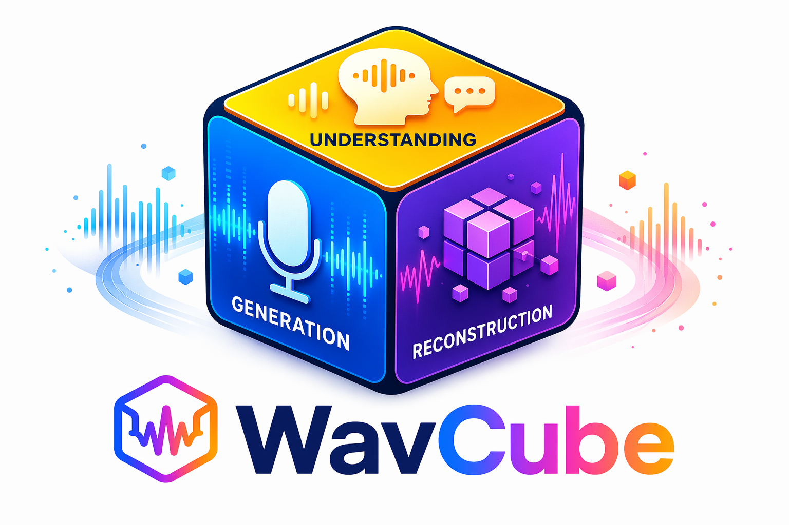

# WavCube: Unifying Speech Representation for Understanding and Generation via Semantic-Acoustic Joint Modeling

<p align="center">
  
</p>

[](https://github.com/yanghaha0908/WavCube)
[](https://arxiv.org/abs/2605.06407)
[](https://huggingface.co/yhaha/WavCube)


WavCube is a 128-dim, 50Hz continuous representation that unifies speech understanding,
reconstruction, and generation within a single space.
This is the official code for the paper [WavCube: Unifying Speech Representation for Understanding and Generation via Semantic-Acoustic Joint Modeling](https://arxiv.org/pdf/2605.06407) [[abs](https://arxiv.org/abs/2605.06407)].

## ✨ Key Features
- **Unified Speech Representation** – A single continuous latent space that simultaneously supports speech understanding, reconstruction, and generation.
- **Semantic-Acoustic Joint Modeling** – Harmonizes high-level semantic structures with low-level acoustic textures.
- **Compact & Diffusion-Friendly** – Features a compact 128-dimensional bottleneck (8x compression from standard SSL features) enabling easier diffusion modeling.
<!-- By infusing fine-grained acoustic details into a distilled SSL semantic manifold, -->


## 🛠️ Installation

We recommend creating a fresh conda environment for installation. 
### Env Setup
```bash
conda create -n WavCube python=3.10 -y
conda activate WavCube
```

### Basic Requirements
```bash
git clone https://github.com/yanghaha0908/WavCube.git
cd WavCube
pip install torch==2.7.0 torchvision==0.22.0 torchaudio==2.7.0 --index-url https://download.pytorch.org/whl/cu126
conda install -c conda-forge sox ffmpeg libsndfile
pip install -e ".[train]"
```

## 🚀 Quick Start

### Checkpoint Download
Pre-trained model checkpoints are available. Please use the following links to download the checkpoints:

| Representation | Dimension | Sample Rate | Frame Rate |
|----------------|-----------|-------------|------------|
| 🤗 [WavCube](https://huggingface.co/yhaha/WavCube/tree/main/WavCube) | 128 | 16k Hz | 50 Hz |
| 🤗 [WavCube-pro](https://huggingface.co/yhaha/WavCube/tree/main/WavCube-Pro) | 128 | 16k Hz | 50 Hz |


### Extract Representation from Speech
You can get continuous representations from raw wav using the following code:

```bash
python wav_to_feature.py \
    --audio 19_198_000000_000002.wav \
    --config configs/WavCube-stage2.yaml \
    --ckpt WavCube/checkpoints/vocos_checkpoint_epoch=177_step=195000_val_loss=3.3080.ckpt \
    --output 19_198_000000_000002.pt
```

### Reconstruct Speech from Representation

You can reconstruct waveform from representations using the following code:

```bash
python feature_to_wav.py \
    --feature 19_198_000000_000002.pt \
    --config configs/WavCube-stage2.yaml \
    --ckpt WavCube/checkpoints/vocos_checkpoint_epoch=177_step=195000_val_loss=3.3080.ckpt
```

<!-- ## 💡 Tips
- For devices that do not support BF16, you can manually disable PyTorch's mixed precision manager.
- If you encounter any issues or have questions, please feel free to open an issue. -->

## 🔧 Training

WavCube employs a **two-stage training** pipeline, all scripts are located in `scripts/train/`.

```bash
# ----------------- WavCube -----------------
bash scripts/train/train_WavCube_stage1.sh
bash scripts/train/train_WavCube_stage2.sh

# --------------- WavCube-Pro ---------------
bash scripts/train/train_WavCube_pro_stage1.sh
bash scripts/train/train_WavCube_pro_stage2.sh
# Note: Update `stage1_ckpt_path` in config to your Stage 1 checkpoint before running.
```

## 🤝 Additional Resources

### Evaluation Checkpoints

To make it easier to reproduce our results, we have uploaded supplementary resources to our 🤗 [WavCube](https://huggingface.co/yhaha/WavCube/tree/main/ckpts). These include the `wavlm-large` weights and the necessary evaluation checkpoints for computing metrics such as WER, Speaker Similarity, and UTMOS.

```bash
# For offline testing or if you experience network issues, you can manually copy the checkpoints to your local cache:
cp -r ckpts/hub ~/.cache/torch/
cp ckpts/utmos22_strong_step7459_v1.pt ~/.cache/torch/hub/checkpoints/ 
cp -r ckpts/s3prl ~/.cache
```

### Data Preparation

**Small-scale data** — uses `VocosDataModule`. Prepare a filelist of audio paths for training and validation:

```bash
find $TRAIN_DATASET_DIR -name "*.wav" > filelist.train
find $VAL_DATASET_DIR -name "*.wav" > filelist.val
```

Each line is a plain audio path, for example:
```
/data/LibriSpeech/test-clean/672/122797/672-122797-0026.flac
/data/LibriSpeech/test-clean/672/122797/672-122797-0071.flac
/data/LibriSpeech/test-clean/672/122797/672-122797-0037.flac
```

**Large-scale data** — uses `VocosEmiliaDataModule`. Two files are required:

1. **Filelist** — same format as above for LibriSpeech; for LibriHeavy, each line is a JSON entry, for example:
```json
{"id": "medium/968/.../voyagesdolittle_55_lofting_64kb_38", "start": 22.32, "duration": 19.36, "channel": 0, "recording": {"sources": [{"source": "download/librilight/medium/968/.../voyagesdolittle_55_lofting_64kb.flac"}], "sampling_rate": 16000}, "type": "MonoCut"}
```

2. **Index file** (`.idx`) — a byte-offset index for fast random access, generated via:
```bash
python data/generate_idx.py
```

Example data manifest files for both formats are provided in the `data/` directory for reference.


## ❤️ Acknowledgements

We sincerely thank the authors of the following open-source projects, whose excellent work laid the foundation for WavCube: [Semantic-VAE](https://github.com/ZhikangNiu/Semantic-VAE), [F5-TTS](https://github.com/swivid/f5-tts), [Vocos](https://github.com/gemelo-ai/vocos), [MiMo-Audio-Tokenizer](https://github.com/XiaomiMiMo/MiMo-Audio-Tokenizer), [s3prl](https://github.com/s3prl/s3prl).


## 📝 Citation

If you find this repo helpful, please cite our work:

```bibtex
@misc{[CITATION_KEY],
      title={[Paper Title Placeholder]},
      author={[Author List]},
      year={2025},
      eprint={[ARXIV_ID]},
      archivePrefix={arXiv},
      primaryClass={cs.SD},
      url={https://arxiv.org/abs/[ARXIV_ID]},
}
```

## 📄 License

The code in this repository is released under the MIT license, see [LICENSE](LICENSE) for details.
